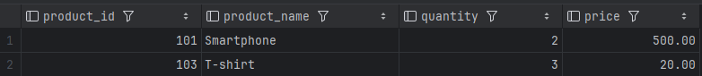
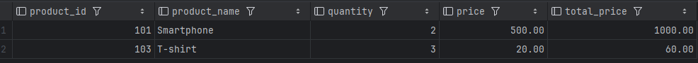
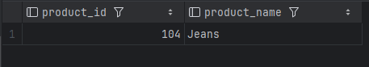
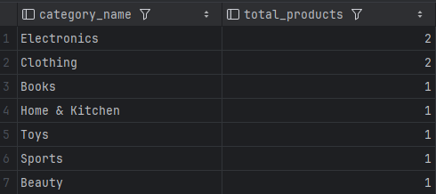
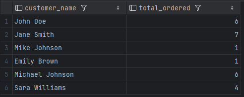
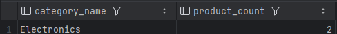
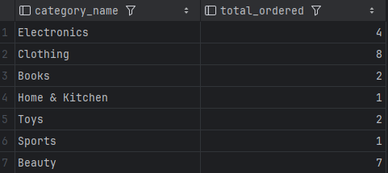
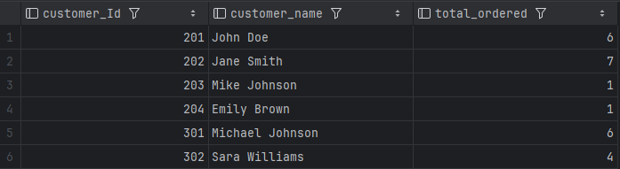
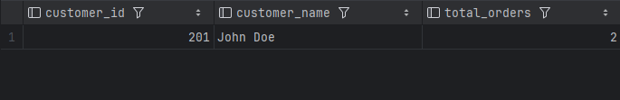
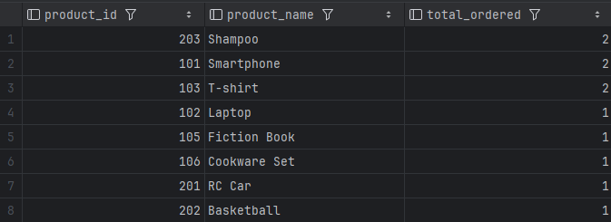

# Test Database

## Phần 1

# Lấy thông tin tất cả các sản phẩm đã được đặt trong một đơn đặt hàng cụ thể.

SELECT P.product_id, P.product_name, OD.quantity, P.price
FROM OrderDetails AS OD
JOIN Products AS P ON OD.product_id = P.product_id
WHERE OD.order_id = 301;

# Tính tổng số tiền trong một đơn đặt hàng cụ thể.

SELECT P.product_id, P.product_name, OD.quantity,price, (P.price \*OD.quantity) as total_price
FROM OrderDetails AS OD
JOIN Products AS P ON OD.product_id = P.product_id
WHERE OD.order_id = 301;

# Lấy danh sách các sản phẩm chưa có trong bất kỳ đơn đặt hàng nào.

SELECT P.product_id, P.product_name
FROM Products AS P
WHERE P.product_id NOT IN (
SELECT DISTINCT OD.product_id
FROM OrderDetails AS OD
);

# Đếm số lượng sản phẩm trong mỗi danh mục. (category_name, total_products)

SELECT C.category_name, COUNT(P.product_id) AS total_products
FROM Categories AS C
LEFT JOIN Products AS P ON C.category_id = P.category_id
GROUP BY C.category_id, C.category_name;

# Tính tổng số lượng sản phẩm đã đặt bởi mỗi khách hàng (customer_name, total_ordered)

SELECT CU.customer_name, SUM(OD.quantity) AS total_ordered
FROM Customers AS CU
JOIN Orders AS O ON CU.customer_id = O.customer_id
JOIN OrderDetails AS OD ON O.order_id = OD.order_id
GROUP BY CU.customer_id, CU.customer_name;

# Lấy thông tin danh mục có nhiều sản phẩm nhất (category_name, product_count)

SELECT C.category_name, COUNT(P.product_id) AS product_count
FROM Categories AS C
LEFT JOIN Products AS P ON C.category_id = P.category_id
GROUP BY C.category_id, C.category_name
ORDER BY product_count DESC
LIMIT 1;

# Tính tổng số sản phẩm đã được đặt cho mỗi danh mục (category_name, total_ordered)

SELECT C.category_name, SUM(OD.quantity) AS total_ordered
FROM Categories AS C
JOIN Products AS P ON C.category_id = P.category_id
JOIN OrderDetails AS OD ON P.product_id = OD.product_id
GROUP BY C.category_id, C.category_name;

# Lấy thông tin về top 3 khách hàng có số lượng sản phẩm đặt hàng lớn nhất (customer_id, customer_name, total_ordered)

select C.customer_Id, C.customer_name, SUM(OD.quantity) as total_ordered
from Customers as C
join Orders as O On C.customer_id = O.customer_id
join OrderDetails OD on O.order_id = OD.order_id
group by C.customer_Id, C.customer_name

# Lấy thông tin về khách hàng đã đặt hàng nhiều hơn một lần trong khoảng thời gian cụ thể từ ngày A -> ngày B (customer_id, customer_name, total_orders)

SELECT CU.customer_id, CU.customer_name, COUNT(O.order_id) AS total_orders
FROM Customers AS CU
JOIN Orders AS O ON CU.customer_id = O.customer_id
WHERE O.order_date BETWEEN '2023-08-01' AND '2023-08-07'
GROUP BY CU.customer_id, CU.customer_name
HAVING COUNT(O.order_id) > 1;

# Lấy thông tin về các sản phẩm đã được đặt hàng nhiều lần nhất và số lượng đơn đặt hàng tương ứng (product_id, product_name, total_ordered)

SELECT P.product_id, P.product_name, COUNT(OD.order_id) AS total_ordered
FROM Products AS P
JOIN OrderDetails AS OD ON P.product_id = OD.product_id
GROUP BY P.product_id, P.product_name
ORDER BY total_ordered DESC;

